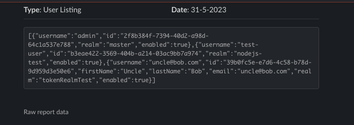
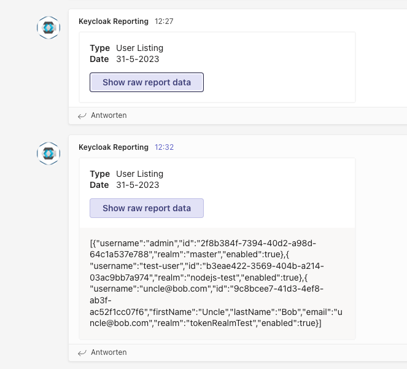

# Keycloak Reporter


[](LICENSE)
[](https://github.com/ContinuousSecurityTooling/keycloak-reporter/actions/workflows/pipeline.yml)
[](https://www.npmjs.com/package/@continuoussecuritytooling/keycloak-reporter)
[](https://www.npmjs.com/package/@continuoussecuritytooling/keycloak-reporter)
[](https://www.npmjs.com/package/@continuoussecuritytooling/keycloak-reporter)
[](https://hub.docker.com/r/continuoussecuritytooling/keycloak-reporting-cli/)
[](https://snyk.io/test/github/ContinuousSecurityTooling/keycloak-reporter)

[](https://hub.docker.com/r/continuoussecuritytooling/keycloak-reporting-cli/)

## Usage

```
npm i @continuoussecuritytooling/keycloak-reporter --location=global
kc-reporter help
```
For listing clients:
```
kc-reporter listClients <Keycloak_Root_URL> <Client_ID> <Client_Secret> --format=csv
```

The output looks for CSV, like that:
```
"client","id","description","realm","enabled","public","allowedOrigins"
"account","d192964b-189e-499b-ada4-b82b37b9cc50",,"master",true,false,"[]"
"account-console","f8ca4598-0335-445c-992e-fed749ff464a",,"master",true,true,"[]"
"admin-cli","615cbe43-0747-4273-8bc4-b7897a27ce39",,"master",true,true,"[]"
"broker","3e3a17c4-37d4-4a66-bb59-0ddd1b0fa4f6",,"master",true,false,"[]"
"keycloak-reporter","363bd6ed-e0fc-48f6-b896-27d9b16be42a","","master",true,false,"["""",""+""]"
"master-realm","5d822cd2-2583-4d45-ae33-c85ebd6099fa",,"master",true,false,"[]"
"nodejs-test-realm","6b6c26e7-175a-45df-a919-de51ca4f4523",,"master",true,false,"[]"
"security-admin-console","239fca1d-e027-4d3b-9814-3b517272cb80",,"master",true,true,"[""+""]"
"tokenRealmTest-realm","10f8398f-44a5-4f4b-9efb-6a0c4b79af66",,"master",true,false,"[]"
"account","bdf23b22-5abb-4823-aa76-9d21216d7143",,"nodejs-test",true,false,"[]"
"account-console","7eb727fb-18d2-482b-8e34-8982a4efffc3",,"nodejs-test",true,true,"[]"
"admin-cli","99aeb26e-222d-4195-a5e8-f2f94db12b83",,"nodejs-test",true,true,"[]"
"broker","6f3a7144-872e-415b-ab9a-d5a66a3f2951",,"nodejs-test",true,false,"[]"
"confidential-client","d0650a93-8fe2-4524-8020-4531b6276230",,"nodejs-test",true,false,"[""http://localhost/confidential-client""]"
"public-client","c2bd2473-f46c-4c51-af36-b40bef9bb644",,"nodejs-test",true,true,"[]"
"realm-management","49fd4151-3d49-4d10-968b-841123831399",,"nodejs-test",true,false,"[]"
"security-admin-console","ed86e5ed-ced1-435c-b62b-632fe545359c",,"nodejs-test",true,true,"[""+""]"
"account","0a57c891-1d38-4782-badf-a68140a8cf76",,"tokenRealmTest",true,true,"[]"
"account-console","977ac593-4fc7-4a69-94f4-d5e88cd563e9",,"tokenRealmTest",true,true,"[]"
"admin-cli","50ada8d5-bd5e-4182-b6c5-dd4ec5c280b6",,"tokenRealmTest",true,true,"[]"
"broker","91ea3c53-9583-40f6-b3ef-e7bfa28a8385",,"tokenRealmTest",true,false,"[]"
"customer-portal","491ff0ea-51e1-41df-8ee2-2865537da924",,"tokenRealmTest",true,false,"[]"
"realm-management","8dec327b-c120-436d-a27a-bed9494962cd",,"tokenRealmTest",true,false,"[]"
"security-admin-console","a136d00b-119b-4fda-a203-2b946add9b4b",,"tokenRealmTest",true,true,"[""+""]"
```

Valid commands are:
- `listClients`
- `listUsers`

## Advanced

### Config file

You can also provider a config file via env var `CONFIG_FILE` and then just provide the commands, e.g.:
```
CONFIG_FILE==$(pwd)/e2e/fixtures/config.json kc-reporter listClients
```

### Post to Slack or Teams

When using this command:
```
kc-reporter listUsers <Keycloak_Root_URL> <Client_ID> <Client_Secret> --format=json --output=webhook --webhookType=slack --webhookUrl=$WEBHOOK_TESTING_SLACK
```
the following entry in slack will be created:


And for Teams:
```
kc-reporter listUsers <Keycloak_Root_URL> <Client_ID> <Client_Secret> --format=json --output=webhook --webhookType=teams --webhookUrl=$WEBHOOK_TESTING_TEAMS
```
the following entry in slack will be created:
